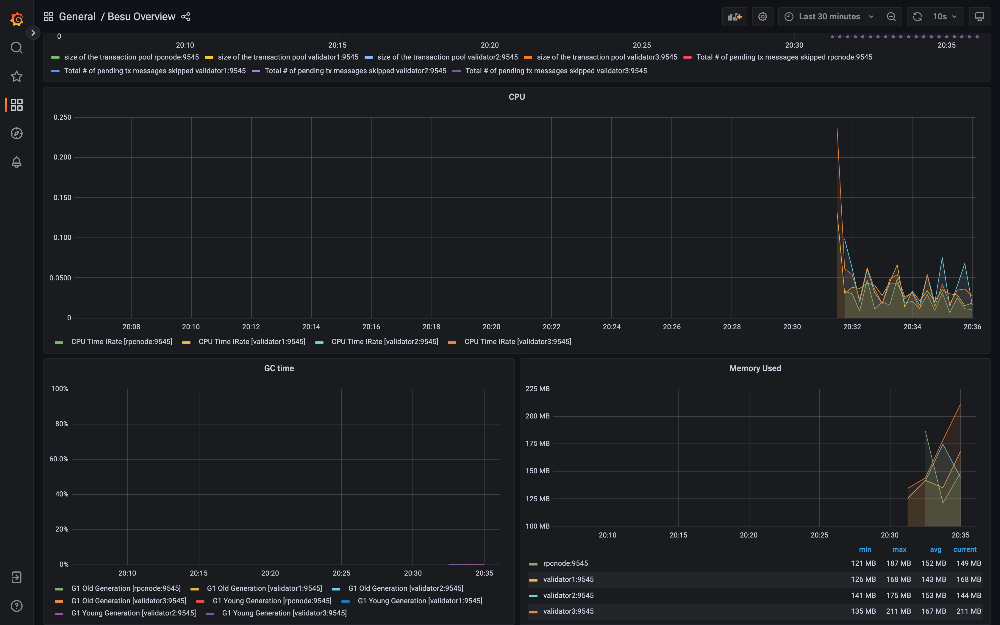

# prometheasy-besu

- [README - Configs for Besu, Prometheus and Grafana](./config/)

# Run Besu with Prometheus + Grafana

Run the latest [Besu](https://github.com/hyperledger/besu) node and monitor it with a Prometheus-powered Grafana dashboard.




## Quick Start

### Requirements

- Docker and Docker Compose

### Test Deployment (Launching multiple nodes in a single server with QBFT consensus)

1. Set `.env` file with your own values

```
BESU_IMAGE_VERSION=latest # Docker image version
BESU_CONFIG=test # You can also create your own config files in the `config/besu` folder
```

2. Run `docker-compose -f docker-compose-multi.yml up -d`. This will start 4 nodes with a Prometheus server and a Grafana server. You can override or pass options with `BESU_OPTS`. e.g. `BESU_OPTS="--data-path=/opt/besu/database --other-option=foo"`. RPC URL default port is 8545.
3. Verify the node has started up by running `docker-compose -f docker-compose-multi.yml logs`.
4. You can access the Grafana dashboard at `http://localhost:3000` with the default username/password of `admin/admin`. The Prometheus server is available at `http://localhost:9090`.
5. To shut down type: `docker-compose -f docker-compose-multi.yml down`

The volumes will persist across restarts, so you can start and stop the node as needed.

## Production Deployment

To Launch nodes with QBFT consensus for production deployment, you have to setup mannually some config files.

Before you start, make sure you have a node key and public key. You can generate them with the following commands:

Run these commands on each node.

```
docker run -it --rm -v $(pwd)/config/keys/production:/opt/besu/config/keys/production hyperledger/besu:<BASU_IMAGE_VERSION>

# and attach to the container
docker attach <container id>

besu --data-path=./config/keys/production/<rpcnode or validtor1...> public-key export
# exit the container
```

### Setup genesis.json

And then you have to setup genesis.json and config.toml files in `config/besu/production/` folder for all besu nodes.

QBFT requres `extraData` field in `genesis.json` with [the specific format](https://besu.hyperledger.org/en/stable/private-networks/how-to/configure/consensus/ibft/?h=extra#configure-ibft-20-consensus).

### Setup static-nodes.json and permissions_config.toml

You have to setup at least one node in `static-nodes.json` in `config/besu/production/` folder for all besu nodes. Based on permission config in `config.toml` you also have to setup `permissions_config.toml`.

1. Update `BESU_CONFIG` filed in `.env` file.

```
BESU_CONFIG=production
```

2. Run `docker-compose -f docker-compose-single.yml up -d` on each server.

## How it works

The `docker-compose-multi.yml` file also spins up a Prometheus server and a Grafana server.
The Prometheus server will scrape the Besu node and the Grafana server will display the metrics in a dashboard.

---

## Acknowledgements

The Prometheus + Grafana docker-compose stack is taken from : https://besu.hyperledger.org/en/stable/private-networks/tutorials/quickstart/#4-update-prometheus-configuration
